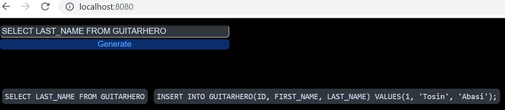

# _Web_ SQL test data generator

This project provides a web page to ease the use of the [_SQL test data generator_ library](https://github.com/quick-perf/sql-test-data-generator).

To launch the application in the demo mode:
* Use _demo_ Maven profile
* Enable _demo_ Spring profile (-Dspring.profiles.active=demo)

To configure the application with your database, complete the [application.properties file](src/main/resources/application.properties).
